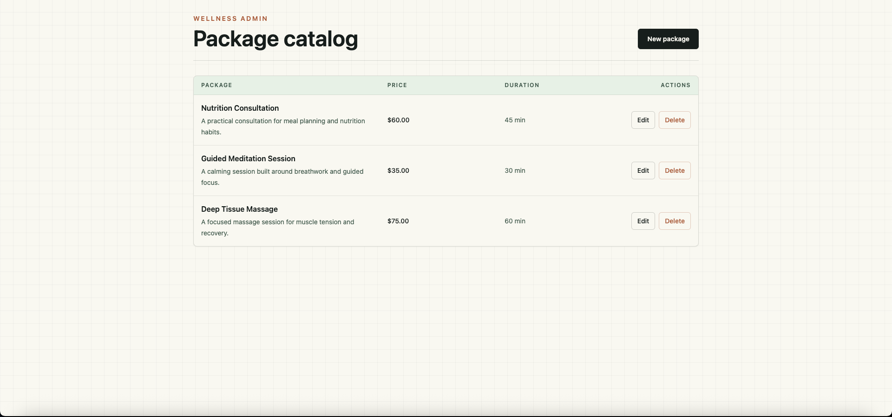
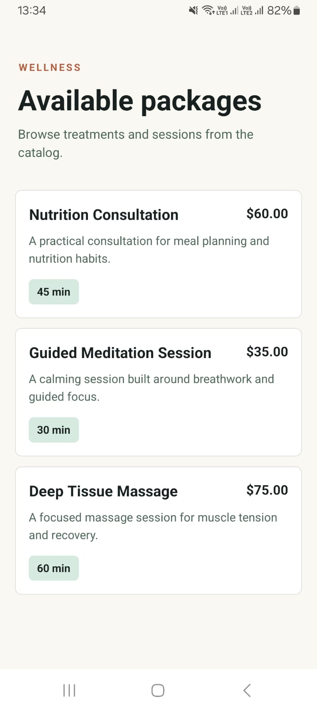
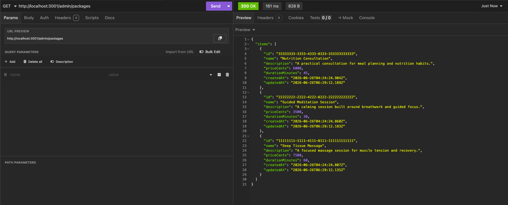

# Wellness Package Management System

A focused full-stack prototype for managing wellness packages across a NestJS API, Next.js admin portal, and Expo React Native mobile app.

## Prerequisites

- Node.js 22
- Docker Desktop for MySQL, the backend API, and the admin portal

## Structure

```text
/backend       NestJS API, Prisma, MySQL, Swagger
/admin-portal  Next.js admin CRUD
/mobile-app    Expo React Native package list
/shared        Zod API contracts and TypeScript types
/docs          Design document and trade-offs
```

## One-Command Spin-Up

Docker Compose starts MySQL, the backend API, and the admin portal:

```bash
docker compose up --build
```

Ports:

- Admin portal: http://localhost:3000
- Backend API: http://localhost:3001
- Swagger docs: http://localhost:3001/api/docs
- MySQL: localhost:3306

The Expo mobile app runs locally because simulator/device networking is environment-specific. Create its local configuration from the tracked example, then replace the example LAN address with the host machine's address when using a physical device:

```bash
cp mobile-app/.env.example mobile-app/.env
pnpm install
pnpm --filter mobile-app start
```

`mobile-app/.env` should contain:

```bash
EXPO_PUBLIC_API_URL=http://192.168.1.10:3001
```

## Local Development Without Docker For Apps

```bash
pnpm install
cp backend/.env.example backend/.env
cp mobile-app/.env.example mobile-app/.env
docker compose up -d mysql
pnpm --filter @wellness/shared build
pnpm --filter backend prisma:deploy
pnpm --filter backend prisma:seed
pnpm --filter backend dev
pnpm --filter admin-portal dev
pnpm --filter mobile-app start
```

## Verification

```bash
pnpm --filter @wellness/shared build
pnpm --filter backend prisma:generate
pnpm exec prettier --check .
pnpm lint
pnpm typecheck
pnpm --filter backend test
pnpm -r build
```

## Design Notes

See [docs/design.md](docs/design.md) for scope, architecture, API contracts, trade-offs, and AI workflow notes.

## Screenshots

### Admin Portal



### Mobile App



### API Response


