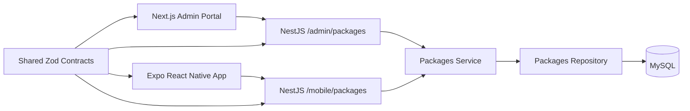

# Wellness Package Management System - Design Plan

## Problem Framing And Scope

This prototype proves one vertical slice of a wellness package catalog:

- Admin users can list, create, edit, and delete wellness packages.
- The backend persists packages in MySQL and exposes separate admin and mobile REST APIs.
- Mobile users can browse packages from the same backend.

Deliberately out of scope:

- Authentication and authorization
- Booking, payments, availability, images, categories, search, and pagination
- Production deployment hardening
- A full design system

The goal is evaluator confidence rather than feature breadth: a narrow path should work end to end, with clear contracts and explicit trade-offs.

## Architecture



Repository layout:

```text
/backend       NestJS API, Prisma, Swagger, service tests
/admin-portal  Next.js CRUD screen
/mobile-app    Expo React Native browse screen
/shared        Zod request/response schemas and inferred TypeScript types
/docs          Design notes and AI workflow
```

The backend uses one package domain module with separate controllers for admin and mobile. The controllers keep consumer-specific API boundaries explicit, while the service and repository avoid duplicating domain logic.

## Data Model

The persisted model is intentionally small:

```text
WellnessPackage
- id UUID
- name string
- description text
- priceCents int
- durationMinutes int
- deletedAt nullable datetime
- createdAt datetime
- updatedAt datetime
```

`deletedAt` implements soft delete and is not exposed in API responses. Package names are not unique because uniqueness depends on future catalog rules such as location, SKU, category, or versioning.

Money is stored as integer minor units (`priceCents`) to avoid JavaScript floating-point precision issues. The prototype assumes a single currency. In a multi-market production system, this would become `priceMinorUnits` plus an ISO-4217 `currencyCode`.

## API Contract

Admin API:

```http
GET    /admin/packages
POST   /admin/packages
GET    /admin/packages/:id
PATCH  /admin/packages/:id
DELETE /admin/packages/:id
```

Mobile API:

```http
GET /mobile/packages
```

Package response:

```json
{
  "id": "uuid",
  "name": "Deep Tissue Massage",
  "description": "Focused massage for muscle tension.",
  "priceCents": 7500,
  "durationMinutes": 60,
  "createdAt": "2026-06-25T10:00:00.000Z",
  "updatedAt": "2026-06-25T10:00:00.000Z"
}
```

List response:

```json
{
  "items": []
}
```

Create request:

```json
{
  "name": "Deep Tissue Massage",
  "description": "Focused massage for muscle tension.",
  "priceCents": 7500,
  "durationMinutes": 60
}
```

Patch request allows partial updates but rejects an empty body.

Validation is defined with Zod in `/shared`. The backend enforces request validation at runtime; admin forms reuse the same contract direction; mobile uses shared types and can parse API responses with Zod when Metro workspace imports are smooth.

## Technical Decisions And Trade-Offs

1. **React Native over Flutter**
   The assessment mentions both React Native and Flutter. I chose React Native because the role and other surfaces are TypeScript-based, which allows shared contracts and reduces context switching.

2. **Lightweight pnpm workspace over Nx**
   Nx would be useful for a larger monorepo with many apps, affected builds, and dependency graph enforcement. For this timeboxed prototype, pnpm workspaces keep setup simpler while preserving shared package boundaries.

3. **Prisma with MySQL**
   MySQL is required by the assessment. Prisma gives fast TypeScript-first schema iteration, migrations, seed data, and concise CRUD queries. For query-heavy reporting, Drizzle or Knex could be reconsidered.

4. **Zod as shared contract source**
   Zod keeps request validation and TypeScript types aligned across backend, admin, and mobile. The backend uses `nestjs-zod` DTOs so request and response schemas can feed NestJS validation and Swagger/OpenAPI metadata without duplicating DTO definitions.

5. **Soft delete without product status**
   Delete sets `deletedAt` rather than removing rows. A fuller `DRAFT`/`ACTIVE`/`ARCHIVED` workflow was considered but omitted to keep the product slice lean.

## AI Workflow Notes

AI was used to stress-test scope and architecture before implementation. Useful prompts included:

- "Grill me on this whole plan one question at a time, and provide your recommended answer."
- "Trade off DECIMAL versus integer minor units for representing price."
- "Why not use nestjs-zod, and what does it improve for OpenAPI integration?"

Course corrections that came from reviewing AI-generated or AI-assisted decisions:

1. The first backend pass used shared Zod schemas for validation but duplicated request/response shapes in a manual `swagger.ts` file for OpenAPI. That worked, but it created drift risk: the Zod contract and Swagger contract could silently diverge. After review, the backend was refactored to use `nestjs-zod` DTOs (`createZodDto`) for both request and response schemas, and the duplicate Swagger helper was removed.

I would avoid using AI blindly for final API contracts and tests. Those need human review because small contract choices affect all three surfaces.

## Production Follow-Ups

- Add authentication and admin guards for `/admin/*`
- Add pagination, search, sorting, and filters
- Generate OpenAPI from Zod schemas to avoid documentation drift
- Add API integration tests with a test database
- Harden Docker images with production builds, health checks, non-root users, and secret management
