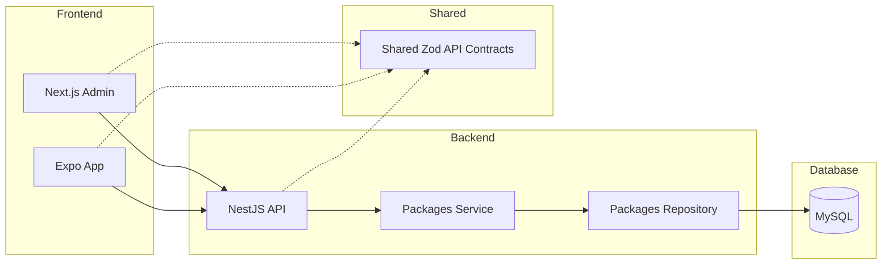

# Wellness Package Management System - Design Plan

## Problem Framing And Scope

This prototype proves one vertical slice of a wellness package catalog:

- Admin users can list, create, edit, and delete wellness packages.
- The backend persists packages in MySQL and exposes separate admin and mobile REST APIs.
- Mobile users can browse packages from the same backend.

Deliberately out of scope:

- Authentication and authorization
- Booking, payments, availability, images, categories, search, and pagination
- Production deployment

Assumptions for this project:

- **Users:** A trusted administrator manages the catalog, while mobile users browse the same visible packages. Authentication, authorization, and audit views are deferred.
- **Scale:** The catalog and read traffic are small, so pagination and caching are intentionally omitted.
- **Requirements:**
  - Packages are displayed in USD. The admin form accepts USD decimal input and the API stores integer cents.
  - Booking and availability are not modeled.

## Architecture



Repository layout:

```text
.
├── backend/
│   ├── prisma/                 schema, migrations, and seed data
│   ├── src/
│   │   ├── common/             cross-cutting Nest validation
│   │   ├── packages/           controllers, service, repository, DTOs, mapping
│   │   ├── prisma/             Prisma client lifecycle
│   │   ├── app.module.ts       composition root
│   │   ├── health.controller.ts
│   │   └── main.ts             HTTP, CORS, and Swagger bootstrap
│   └── test/                   focused unit tests
├── admin-portal/
│   └── src/
│       ├── app/                Next.js route shell and providers
│       ├── features/packages/  package table, modal, and form model
│       └── lib/                API client and presentation formatting
├── mobile-app/
│   ├── App.tsx                 Expo entry point and catalog screen
│   └── src/lib/                mobile API client and formatting
├── shared/src/                 Zod API contracts and inferred types
├── docs/                       design notes and submission screenshots
├── .github/workflows/          continuous integration
└── docker-compose.yml          local service orchestration
```

The backend uses a vertical `packages` domain module with separate controllers for admin and mobile. Controllers own consumer-specific HTTP boundaries; the service owns use-case logic; the repository owns persistence; and mapping stays separate from Prisma records.

The admin portal follows `app` for routing and composition, `features` for package UI, and `lib` for shared client utilities. 

The mobile app is intentionally smaller: its single screen remains at the Expo entry point while its API and formatting logic live under `src/lib`.

Shared concerns are explicit: `/shared` owns Zod API contracts and inferred types, the backend turns validation failures into a consistent error payload, and each surface has an `.env.example` for its API or database configuration.

## Data Model

The persisted model is intentionally small:

```text
WellnessPackage
- id UUID
- name string
- description text
- priceCents int
- durationMinutes int
- deletedAt nullable datetime
- createdAt datetime
- updatedAt datetime
```

- `deletedAt` implements soft delete and is not exposed in API responses. 
- Package names are not unique because uniqueness depends on future catalog rules such as location, SKU, category, or versioning.
- Money is stored as integer minor units (`priceCents`) to avoid JavaScript floating-point precision issues. The prototype assumes a single currency. In a multi-market production system, this would become `priceMinorUnits` plus an ISO-4217 `currencyCode`.

## API Contract

Admin API:

| Method   | Route                 | Success                         | Error outcomes                                                   |
| -------- | --------------------- | ------------------------------- | ---------------------------------------------------------------- |
| `GET`    | `/admin/packages`     | `200` with all visible packages | -                                                                |
| `POST`   | `/admin/packages`     | `201` with the created package  | `400` for invalid input                                          |
| `GET`    | `/admin/packages/:id` | `200` with one visible package  | `400` for an invalid UUID; `404` when missing or deleted         |
| `PATCH`  | `/admin/packages/:id` | `200` with the updated package  | `400` for an invalid UUID or body; `404` when missing or deleted |
| `DELETE` | `/admin/packages/:id` | `204` after soft delete         | `400` for an invalid UUID; `404` when missing or deleted         |
| `GET`    | `/mobile/packages`    | `200` with all visible packages | -                                                                |
| `GET`    | `/health`             | `200` with `{ "status": "ok" }` | -                                                                |

Package response:

```json
{
  "id": "uuid",
  "name": "Deep Tissue Massage",
  "description": "Focused massage for muscle tension.",
  "priceCents": 7500,
  "durationMinutes": 60,
  "createdAt": "2026-06-25T10:00:00.000Z",
  "updatedAt": "2026-06-25T10:00:00.000Z"
}
```

List response:

```json
{
  "items": []
}
```

Create request:

```json
{
  "name": "Deep Tissue Massage",
  "description": "Focused massage for muscle tension.",
  "priceCents": 7500,
  "durationMinutes": 60
}
```

Validation rules:

- `name` is trimmed and 1-120 characters,
- `description` is trimmed and 1-1000 characters,
- `priceCents` is a non-negative integer, and
- `durationMinutes` is an integer from 1 to 1,440.
- Patch accepts any non-empty subset of those fields.

Validation failures use the `400` response shape below:

```json
{
  "error": {
    "code": "VALIDATION_ERROR",
    "message": "Request validation failed",
    "details": [
      {
        "path": "name",
        "message": "String must contain at least 1 character(s)"
      }
    ]
  }
}
```

Missing packages return `404` with `error.code` set to `PACKAGE_NOT_FOUND`.

Validation is defined with Zod in `/shared`. The backend enforces request validation at runtime; admin forms reuse the same contract direction; mobile uses shared types and can parse API responses with Zod when Metro workspace imports are smooth.

## Technical Decisions And Trade-Offs

1. **React Native over Flutter**
   - The assessment overview specifies React Native with TypeScript, while the thin-prototype checklist refers to Flutter. I treated that as an inconsistency and chose React Native because the role and other surfaces are TypeScript-based, which allows shared contracts and reduces context switching.

2. **Lightweight pnpm workspace over Nx**
   - Nx would be useful for a larger monorepo with many apps, affected builds, and dependency graph enforcement. For this timeboxed prototype, pnpm workspaces keep setup simpler while preserving shared package boundaries.

3. **Prisma with MySQL**
   - MySQL is required by the assessment. Prisma gives fast TypeScript-first schema iteration, migrations, seed data, and concise CRUD queries. For query-heavy reporting, Drizzle or Knex could be reconsidered.

4. **Zod as shared contract source**
   - Zod keeps request validation and TypeScript types aligned across backend, admin, and mobile. The backend uses `nestjs-zod` DTOs so request and response schemas can feed NestJS validation and Swagger/OpenAPI metadata without duplicating DTO definitions.

5. **Soft delete without product status**
   - Delete sets `deletedAt` rather than removing rows. A fuller `DRAFT`/`ACTIVE`/`ARCHIVED` workflow was considered but omitted to keep the product slice lean.

## Production Follow-Ups

- Add authentication and admin guards for `/admin/*`
- Add pagination, search, sorting, and filters
- Add cache-aside reads for the mobile catalog when measured traffic warrants them
- Deploy the backend and admin portal as separate containers, use managed MySQL, and run migrations once as a release step

## AI Workflow Notes

I used both Codex and Claude Code as a collaborative engineering tool to:

- interrogate the initial plan,
- scaffold implementation work,
- diagnose runtime and CI failures, and
- run focused verification commands.

Useful prompt sequences included:

- "Grill me on this whole plan one question at a time, and provide your recommended answer."
  - This turned broad architecture choices into explicit decisions about the scope before implementation began.
- "Trade off DECIMAL versus integer minor units for representing price."
  - This produced a concrete representation decision that I could test in every surface: USD input in the admin form, integer cents in the API and database, and formatted dollars in clients.
- "Why not use nestjs-zod?"
  - This led to a reviewable change from manually duplicated Swagger shapes to Zod-derived Nest DTOs.

Course corrections that came from reviewing AI-generated or AI-assisted decisions:
- The first backend pass used shared Zod schemas for validation but duplicated request/response shapes in a manual `swagger.ts` file for OpenAPI. That worked, but it created drift risk: the Zod contract and Swagger contract could silently diverge. After review, the backend was refactored to use `nestjs-zod` DTOs (`createZodDto`) for both request and response schemas, and the duplicate Swagger helper was removed. 
- The first admin implementation concentrated page state, data fetching, mutations, table rendering, form validation, and modal UI in one `page.tsx`. It worked, but review showed that ordinary changes would be unnecessarily risky. I split it into a page-level orchestrator, `PackageTable`, `PackageFormModal`, and a form-model module that owns validation and price conversion. React Query state remains at the page boundary, while presentation and form concerns now have clear ownership.

Where I chose NOT to use AI:
- I did not use AI as the authority for deciding that a feature was complete. I manually verified the admin CRUD flow, the mobile app’s connection to the real API, browser CORS behavior, and clean CI execution. 
- I did not let AI decide the final scope. I used it to challenge alternatives, but I chose to omit authentication, booking, payments, search, and pagination because the assessment values one proven vertical slice over feature breadth.
